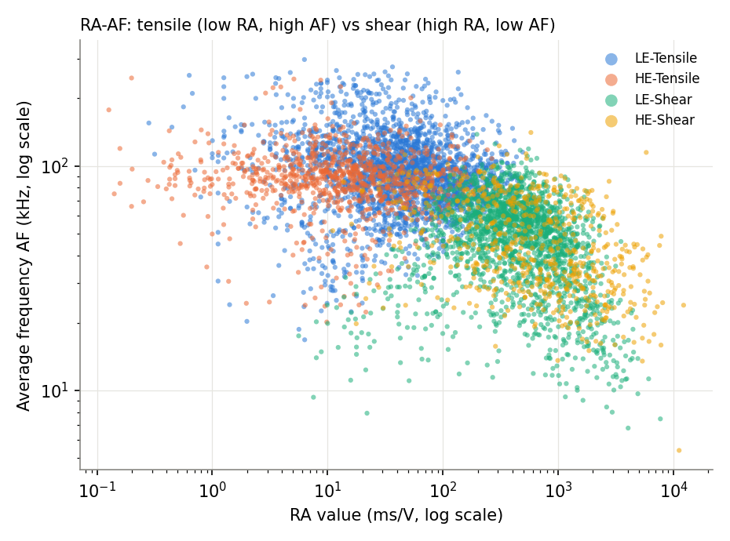
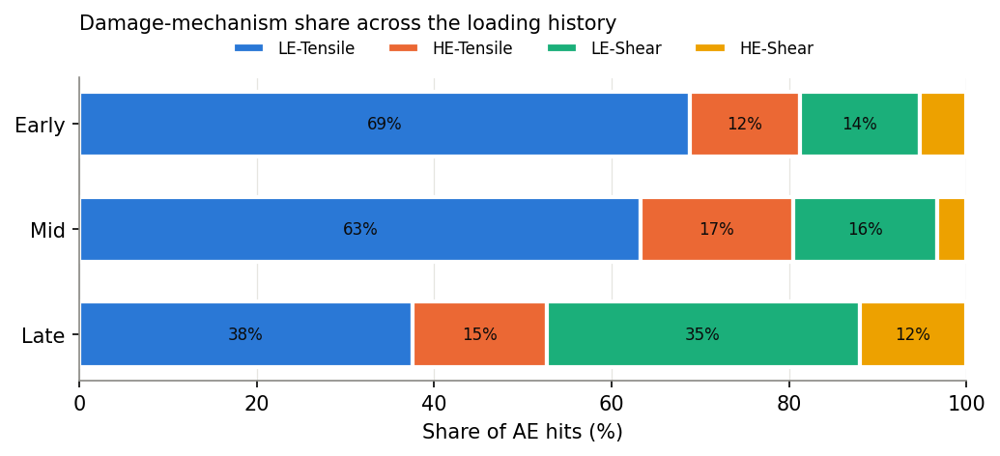

# Damage Characterisation of GFRP Composites under Impact and Compression using Acoustic Emission and Data-Driven Analysis

A machine-learning project that identifies damage mechanisms in glass fibre reinforced polymer (GFRP) laminates from acoustic emission (AE) signals, without using pre-assigned labels. It includes a Streamlit app that classifies new AE files and can repeat the whole workflow on AE data from any material.

Course project for **AE23722 – Artificial Intelligence and Machine Learning for Aeronautical Engineering**, Rajalakshmi Engineering College (Autonomous), Chennai.

## What it does

Earlier work on this dataset sorted AE hits into damage modes using fixed peak-frequency bands. Those bands are specific to one material and test set-up, and they leave 8.6% of the hits unclassified.

This project takes a different route:

1. **Features.** Amplitude, energy, duration, counts and rise time, plus two derived parameters: RA (rise time / amplitude) and AF (counts / duration).
2. **Unsupervised clustering.** K-means groups the hits with no labels. The number of clusters is chosen with the Davies–Bouldin index.
3. **Physical validation.** The clusters are checked against RA–AF behaviour, the order of damage during loading, and impacted vs non-impacted specimens.
4. **Classifier.** A Random Forest learns the clusters so new AE files can be classified instantly. It is benchmarked against kNN.
5. **App.** A Streamlit interface shows the results, predicts on new files, and trains on any uploaded AE dataset.

## Results

| Item | Result |
|---|---|
| AE hits analysed | 30,574 from 8 specimens (0, 1, 3, 5 wt% cenosphere; CAI and pure compression) |
| Damage mechanisms found | 4: low-energy tensile, high-energy tensile, low-energy shear, high-energy shear |
| Cluster stability | Adjusted Rand Index 0.972 across bootstrap samples |
| Damage progression | Shear activity rises from 19% of hits early in loading to 47% late |
| Effect of impact | Delamination-type activity is 14.2% in impacted specimens vs 6.0% in non-impacted |
| Previously unclassified hits | All 2,617 assigned a mechanism |
| Random Forest accuracy | 98.1% (90/10 split), 98.2% (leave-one-specimen-out) |
| kNN accuracy | 96.0% (90/10 split), 96.2% (leave-one-specimen-out) |
| Prediction confidence | 95% of predictions are confident, and 99.7% of those are correct |





## Project structure

```
project/
├── ae_clustering_analysis.py   Analysis: features, clustering, validation, training, figures
├── app.py                      Streamlit application
├── requirements.txt            Python packages
├── data/
│   ├── master_labeled.csv      Master AE dataset (30,574 hits)
│   ├── sample_new_ae_file.csv  300-hit file for the prediction demo
│   └── demo_single_test.csv    Single-test file for the "Train on Your Own Data" demo
├── models/
│   └── ae_cluster_model.joblib Trained Random Forest
├── figures/                    Result charts (PNG)
└── results/                    Result tables (CSV)
```

## How to run

Requires Python 3.10 or later.

```bash
git clone https://github.com/sivamahalakshmi/AIML_Composites_Damage_Prediction.git
cd AIML_Composites_Damage_Prediction/project
pip install -r requirements.txt
streamlit run app.py
```

The trained model is included, so the app works straight away.

To regenerate the clusters, figures, result tables and model from the dataset:

```bash
python ae_clustering_analysis.py
```

## App pages

| Page | What it shows |
|---|---|
| Home | Project summary and the four damage mechanisms |
| Damage Clustering | Cluster selection, cluster plot, RA–AF plot, damage progression, impact comparison |
| Model Validation | Random Forest vs kNN, confusion matrix, feature importance, prediction confidence |
| Source Study Comparison | Comparison with the findings of the original experimental study |
| Predict New AE Data | Upload an AE file or enter one hit; get the mechanism and confidence for every hit |
| Train on Your Own Data | Upload AE data from any material; the app clusters it and trains a model for it |

**Quick demo**

- Prediction: on *Predict New AE Data*, upload `data/sample_new_ae_file.csv`.
- Any material: on *Train on Your Own Data*, upload `data/demo_single_test.csv` and click **Run clustering**.

## Using it with your own AE data

The built-in model is specific to the GFRP/cenosphere laminates of this study. The method is not.

On the *Train on Your Own Data* page, upload a CSV or Excel file with one row per AE hit and columns for amplitude, energy, duration, counts and rise time. Column names can differ; the app lets you match them. It then picks the number of clusters, groups the hits, names the groups as tensile or shear and low or high energy, and trains a classifier for that dataset.

## Limitations

- The dataset has one specimen per condition, so trends with filler content are observations, not established effects.
- Mechanism names are interpretations from RA–AF and energy behaviour. Confirming them needs microscopy.
- The classifier's accuracy measures how well it reproduces the clusters, not agreement with an independent ground truth.
- Results on materials other than this laminate system have not been validated.

## Team

- Sanjay Ramaswamy C (230101048)
- Sivamahalakshmi S (230101053)

**Guide:** Mr. Balaji R, Assistant Professor (SG), Department of Aeronautical Engineering, Rajalakshmi Engineering College.

## Data source

The AE data come from the experimental study below. No fabrication or testing was done in this project.

Balaji, R. & Dinesh Kumar, P. K. (2021). Influence of Cenosphere on Compression After Impact Strength of Glass Epoxy Laminates. *Engineering Research Express*, 3(4), 045052.

## Built with

Python, pandas, NumPy, scikit-learn, Matplotlib, Streamlit.
